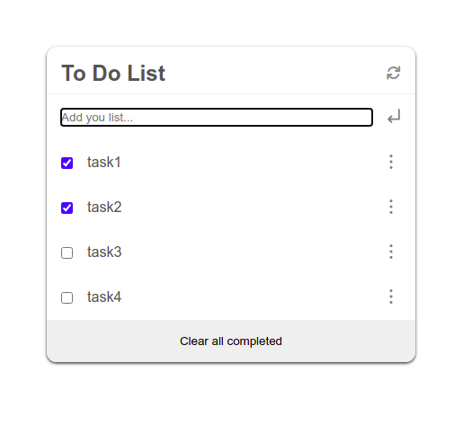

# To Do List Webapp

> A web app to create a To Do list online. This webapp is built with webpack. A local storage option is added with this project, so that a user can store data in this is web app.



## Live Link

Project's [Live Link](https://vikipretium.github.io/To_Do_List/)

Additional description about the project and its features.

## Tech used

- HTML
- CSS
- Javascript
- Git
- Webpack
- npm

# Setup WebApp

#### Cloning the project

```
git clone https://github.com/vikipretium/To_Do_List.git
```

## Usage

To build the project run:

```
$ npm install
$ npm run build
```

## Development

In development environment use the following command:

```
$ npm run dev
```

## Author

👤 **Vignesh**

- GitHub: [@vikipretium](https://github.com/vikipretium)
- Twitter: [@vikipretium](https://twitter.com/vikipretium)
- LinkedIn: [vikipretium](https://linkedin.com/in/vikipretium)

Contributions, issues, and feature requests are welcome!

Feel free to check the [issues page](../../issues/).

## Show your support

Give a ⭐️ if you like this project!

## Acknowledgments

- Hat tip to anyone whose code was used
- Inspiration
- etc

## 📝 License

This project is [MIT](./MIT.md) licensed.
